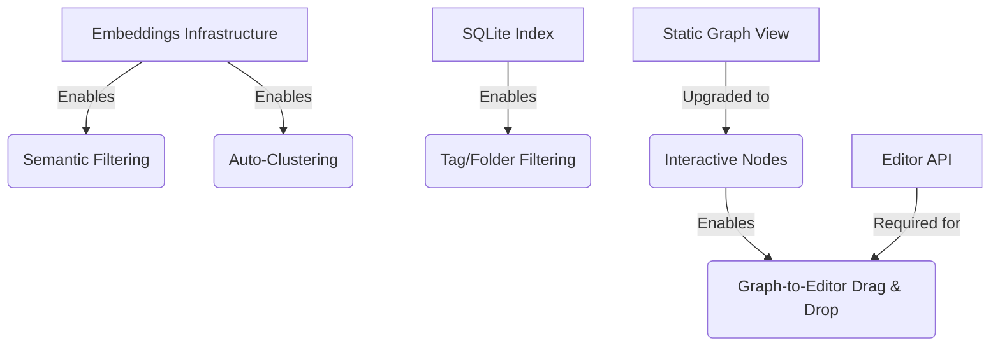

# Feature Landscape: Interactive Graph Workspace

**Domain:** Graph Visualization & Interaction for PKM
**Researched:** 2026-02-06
**Confidence:** HIGH

## Executive Summary

The transition from a static graph to an interactive workspace involves moving from a **passive viewing** experience to an **active manipulation** experience. In the modern PKM ecosystem (Obsidian, Heptabase, Logseq), the graph is increasingly treated as a "spatial canvas" where users organize thoughts by proximity and connection, not just hierarchy.

Key findings suggest that **Graph-to-Editor integration** and **Selective Filtering** are the highest-value features, while **3D views** and **constant physics recalculations** are generally considered distractions.

---

## Table Stakes

Features users expect as a baseline for any interactive graph.

| Feature               | Why Expected                | Complexity | Notes                                                      |
| --------------------- | --------------------------- | ---------- | ---------------------------------------------------------- |
| **Click-to-Open**     | Standard navigation pattern | Low        | Single click to highlight, double click to navigate.       |
| **Hover Tooltips**    | Rapid content discovery     | Medium     | Show note title + first 100 chars or first paragraph.      |
| **Node Filtering**    | Managing visual noise       | Medium     | Support for tags, folders, and text search strings.        |
| **Local Graph Mode**  | Contextual focus            | Medium     | Show only nodes within N-steps of the current active note. |
| **Zoom/Pan Controls** | Basic spatial navigation    | Low        | Mouse wheel to zoom, click-drag to pan canvas.             |

## Differentiators

Features that set NoteTaiker apart as a "smart" workspace.

| Feature                    | Value Proposition            | Complexity | Notes                                                                          |
| -------------------------- | ---------------------------- | ---------- | ------------------------------------------------------------------------------ |
| **Drag-to-Editor Linking** | Seamless connection building | Medium     | Drag node from graph into editor to insert `[[wikilink]]`.                     |
| **Semantic Coloring**      | Highlighting by concept      | Medium     | Color nodes based on embedding similarity to a specific query.                 |
| **Manual Pinning**         | Spatial memory               | Medium     | Allow users to "pin" a node to a coordinate to prevent physics from moving it. |
| **Lasso Selection**        | Bulk management              | High       | Select a region of nodes to apply tags or open multiple tabs.                  |
| **Graph-as-Breadcrumbs**   | Path visualization           | Low        | Highlight the sequence of notes the user has recently visited.                 |

## Anti-Features

Common pitfalls to avoid.

| Anti-Feature              | Why Avoid                                 | What to Do Instead                                                        |
| ------------------------- | ----------------------------------------- | ------------------------------------------------------------------------- |
| **3D Rendering**          | Obscures nodes, hard to navigate          | Stick to 2D with smart grouping/clustering.                               |
| **Force-Directed Jitter** | Physics that never settles is distracting | Use a "cooling" factor so the graph stops moving after a few seconds.     |
| **Auto-deletion**         | Risk of accidental data loss              | Graph actions should modify metadata (tags) or links, never delete files. |
| **Massive Global Graphs** | "Spaghetti ball" problem                  | Default to Local Graph; make Global Graph an opt-in "Big Picture" view.   |

---

## Feature Dependencies

## MVP Recommendation

For the "Interactive Workspace" milestone, prioritize:

1.  **Graph-to-Editor Navigation:** Double-click to open, hover for preview.
2.  **Local Graph View:** Toggle to focus on the active note's neighborhood.
3.  **Basic Filtering:** Toggle tags and "orphans" (notes with no links).
4.  **Drag-to-Link:** Initial support for dragging a node into the editor to create a link.

**Post-MVP:** Lasso selection, Semantic coloring, and Saved workspaces.

---

## Sources

- [Obsidian Graph View Best Practices](https://help.obsidian.md/Plugins/Graph+view)
- [Heptabase: The Power of Spatial Thinking](https://heptabase.com/)
- [Logseq Graph Interaction Patterns](https://docs.logseq.com/)
- [PKM Community Forums: "What makes a graph view useful?"](https://forum.obsidian.md/)
