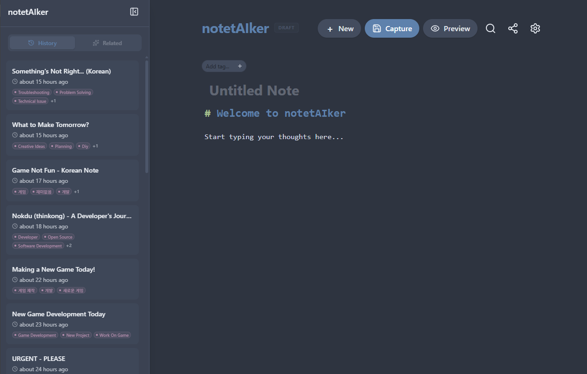

# notetAIker

A local-first, AI-enhanced note-taking desktop app designed for zero-friction capture. Input anything into a stream of atomic Markdown files while background AI agents automatically organize your content by generating tags, computing semantic embeddings, and surfacing relationships between your notes.

**Website**: [notetaiker.a-bba.dev](https://notetaiker.a-bba.dev)



## Download

Download the latest release for your platform from the [website](https://notetaiker.a-bba.dev) or install via the command line.

**macOS / Linux**

```bash
curl -fsSL https://notetaiker.a-bba.dev/install | bash
```

**Windows (PowerShell)**

```powershell
powershell -c "irm notetaiker.a-bba.dev/install.ps1 | iex"
```

You can also grab builds directly from [GitHub Releases](https://github.com/thinkong/notetaiker/releases).

### Supported Platforms

| OS      | Architecture          |
| ------- | --------------------- |
| Windows | x64 (Intel/AMD)       |
| macOS   | ARM64 (Apple Silicon) |
| Linux   | x64, ARM64            |

### System Requirements

- Multi-core CPU (Intel/AMD x64 or ARM64)
- 4 GB RAM minimum
- 500 MB disk space for app + models

## Features

- **Zero-Friction Capture**: Open the app and start typing immediately. Press `Cmd+Enter` (or `Ctrl+Enter`) to save.
- **Auto-Save**: Notes are saved automatically as you type with a debounced 1-second delay.
- **Draft Persistence**: Unsaved work survives app restarts — drafts are preserved in local storage and restored on relaunch.
- **Local-First**: All data is stored as plain Markdown files on your disk. You own your data.
- **AI-Powered Organization**: Background agents analyze your notes and generate tags automatically. Dismiss or keep AI suggestions.
- **Ollama Integration**: Auto-start Ollama, download and manage models directly from the app with dedicated text, embedding, and image model slots.
- **Semantic Search & Related Notes**: Vector embeddings power similarity-based discovery so you can find notes related to what you're reading.
- **Graph Visualization**: Explore your notes as an interactive force-directed graph with tag-based links, semantic clustering (DBSCAN), filtering, and local-view navigation.
- **Markdown Preview**: Toggle between edit and rendered preview modes in the editor.
- **Multi-Model Support**: Configure OpenAI, Anthropic, Google Gemini, or local Ollama models for AI processing.
- **Atomic Notes**: Each note is a separate Markdown file with YAML frontmatter for metadata.
- **Navigation Guard**: The app warns you before navigating away from unsaved changes, with options to save, discard, or cancel.
- **Collapsible Sidebar**: Toggle the sidebar with `Cmd+B`. Responsive layout adapts to mobile screens.
- **Power User Friendly**: Keyboard shortcuts, a command palette (`Cmd+K`), hashtag autocomplete, and a Markdown editor built on CodeMirror 6.
- **Real-Time Feedback**: Server-Sent Events keep the UI in sync with background processing status.

## Usage

### Capture

1. Open the app — the editor is immediately focused.
2. Type your note in Markdown.
3. Press `Cmd+Enter` (or `Ctrl+Enter`) to save.
4. Use `#hashtags` inline to add manual tags.

### Search & Navigation

- Press `Cmd+K` to open the Command Palette.
- Search by text content or tags.
- Use arrow keys to navigate results and `Enter` to open a note.
- Browse the **Timeline** sidebar for chronological history with infinite scroll.
- View **Related Notes** in the sidebar for semantically similar content.

### Graph View

- Switch to the Graph View to see all notes and tags as an interactive force-directed graph.
- **Filter** by tags using the toolbar (AND/OR modes).
- **Local View**: Alt+click a node to focus on its immediate neighborhood.
- **Semantic Clustering**: Toggle cluster coloring to see groups of related notes detected by DBSCAN.
- **High Contrast**: Toggle a high-contrast color palette for accessibility (persisted across sessions).
- **Double-click** a node to navigate to that note.

### AI Configuration

1. Go to **Settings** (via the command palette or navigation).
2. Enter your API key for your preferred provider (OpenAI, Anthropic, Google Gemini, or use Ollama for local models).
3. The system validates the key and enables background processing.
4. Monitor and retry failed jobs from the Settings page.

### Ollama Model Management

1. Navigate to **Settings > Models**.
2. Browse the model catalog and download models for text, embedding, or image slots.
3. Activate, switch, or delete models from within the app.
4. Ollama is auto-started when needed and shut down on app exit.

### Embeddings

1. Navigate to **Settings > Smart Connections**.
2. View indexing status (indexed notes vs total).
3. Trigger a full **Rebuild** if needed.

## Architecture

notetAIker is a Bun monorepo.

### Monorepo Structure

```
notetaiker/
├── apps/
│   ├── desktop/      # Main application (Electrobun desktop, Hono API, React frontend)
│   ├── cli/          # CLI tool
│   └── website/      # Marketing/landing site
├── packages/
│   ├── env/          # Shared environment config (Zod-validated)
│   ├── eslint-config/# Shared ESLint configuration
│   └── tsconfig/     # Shared TypeScript configuration
├── data/notes/       # Note storage (Markdown files)
└── .notetaiker/      # SQLite databases and secrets
```

### Frontend (`apps/desktop/src/web`)

- **Framework**: React 19 + Vite
- **Styling**: Tailwind CSS v4
- **State**: TanStack Query v5
- **Editor**: CodeMirror 6 with markdown extensions, hashtag autocomplete, and link handling
- **Graph**: `react-force-graph-2d` with D3-force physics
- **Routing**: React Router v7
- **Search**: Command palette powered by `cmdk`
- **Icons**: Lucide React
- **Forms**: React Hook Form

### Backend (`apps/desktop/src/api`)

- **Server**: Hono (running on Bun)
- **Database**: SQLite via `bun:sqlite` + `sqlite-vec` (for indexing and job queues, **not** note storage)
- **AI Integration**: Vercel AI SDK with providers for OpenAI, Anthropic, Google Gemini, and Ollama
- **Async Processing**: `p-queue` and `p-retry` for background jobs with concurrency control
- **Validation**: Zod schemas for all request/response data

### Data Model

- **Notes**: Atomic Markdown files with YAML frontmatter (`id`, `title`, `tags`, `ai_tags`, `ignored_tags`, `createdAt`, `updatedAt`).
- **Index**: SQLite database for fast full-text search and metadata queries.
- **Embeddings**: 768-dimension vectors stored in `sqlite-vec` virtual tables for semantic similarity.
- **Jobs**: SQLite-backed queue with `analysis` (AI tagging) and `embeddings` job types.

## API Endpoints

| Method   | Path                          | Description                     |
| -------- | ----------------------------- | ------------------------------- |
| `GET`    | `/notes`                      | List notes (paginated)          |
| `POST`   | `/notes`                      | Create a new note               |
| `GET`    | `/notes/:id`                  | Get a note by ID                |
| `PATCH`  | `/notes/:id`                  | Update note metadata            |
| `GET`    | `/notes/:id/related`          | Get semantically related notes  |
| `GET`    | `/settings`                   | Get current settings            |
| `POST`   | `/settings`                   | Save settings                   |
| `POST`   | `/settings/validate`          | Validate an API key             |
| `GET`    | `/settings/failed-jobs`       | Get failed job count            |
| `POST`   | `/settings/retry-jobs`        | Retry failed jobs               |
| `GET`    | `/embeddings/status`          | Get embedding index status      |
| `POST`   | `/embeddings/rebuild`         | Rebuild embedding index         |
| `GET`    | `/api/clusters`               | Get semantic clusters           |
| `POST`   | `/api/clusters/rebuild`       | Rebuild clusters                |
| `GET`    | `/api/models/slots`           | Get model slot configuration    |
| `GET`    | `/api/models/catalog`         | Get available model catalog     |
| `GET`    | `/api/models/status`          | Get model download status       |
| `GET`    | `/api/models/ollama-status`   | Check Ollama availability       |
| `POST`   | `/api/models/download`        | Start model download            |
| `POST`   | `/api/models/activate`        | Activate a model for a slot     |
| `POST`   | `/api/models/cancel-download` | Cancel model download           |
| `DELETE` | `/api/models/:modelId`        | Delete a model                  |
| `GET`    | `/api/events`                 | SSE stream for real-time events |
| `GET`    | `/health`                     | Health check                    |

## Development

### Prerequisites

- **Bun**: v1.1 or higher
- **Git**

### Getting Started

1. **Clone the repository**

   ```bash
   git clone https://github.com/thinkong/notetaiker.git
   cd notetaiker
   ```

2. **Install dependencies**

   ```bash
   bun install
   ```

3. **Configure Environment**

   Copy the example environment file:

   ```bash
   cp .env.example .env
   ```

   The default configuration stores notes in `./data/notes` relative to the project root. Modify `NOTES_DIR` in `.env` to change the storage location.

4. **Start Development Server**

   This command starts both the API server (port 3001) and the Web client (port 5173):

   ```bash
   bun run dev
   ```

   - **Web Interface**: [http://localhost:5173](http://localhost:5173)
   - **API Server**: [http://localhost:3001](http://localhost:3001)

### Commands

| Command                 | Description                           |
| ----------------------- | ------------------------------------- |
| `bun run dev`           | Start API and Web in development mode |
| `bun run build`         | Build all packages and apps           |
| `bun run lint`          | Run ESLint across the monorepo        |
| `bun run lint:fix`      | Run ESLint with auto-fix              |
| `bun run format`        | Format code with Prettier             |
| `bun run desktop:dev`   | Build web then start Electrobun app   |
| `bun run desktop:build` | Build web and Electrobun package      |

## Tech Stack

| Layer        | Technologies                                                                                         |
| ------------ | ---------------------------------------------------------------------------------------------------- |
| Frontend     | React 19, Vite, Tailwind CSS v4, TanStack Query, CodeMirror 6, React Router v7, react-force-graph-2d |
| Backend      | Hono, bun:sqlite, sqlite-vec, Vercel AI SDK, p-queue                                                 |
| AI Providers | OpenAI, Anthropic, Google Gemini, Ollama                                                             |
| Dev Tools    | TypeScript, ESLint, Prettier, Vitest, Bun, Husky, Commitlint                                         |
| Desktop      | Electrobun                                                                                           |

## License

GNU GPLv3
